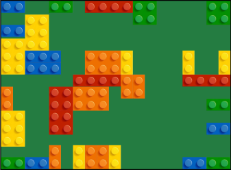

# Knollbot UI

<a href="https://yamaton.github.io/knollbot">

</a>

Interactive demo: https://yamaton.github.io/knollbot

* Double click: Rotate a block
* L key: Toggle alignment lines
* P key: Toggle random poking


## What's Knollbot and knolling?

Knollbot is an attempt to organize desktops and floors with ideas of knolling. The big picture is to automate the entire processes. Here we provide user interface to help knolling.


[Knolling](https://en.wikipedia.org/wiki/Tom_Sachs?oldformat=true#Knolling) is a 2D layout with focus of grouping and alignining. You can find many examples in [/r/knolling](https://www.reddit.com/r/knolling/). People say Wes Anderson's films use the ideas of knolling.


## Build and run

```shell
git clone https://github.com/yamaton/knollbot.git
cd knollbot

# install node packages
npm install --save-dev
npm install

# apply a patch to @types/matter-js 0.14.5
./apply_patch.sh

# Run webpack dev server
npm run start:dev

# Open browser http://localhost:9000
firefox http://localhost:9000
```


## TODOs

- [ ] Group based on colors and sizes
- [ ] Accomodate non-rectangular blocks
- [ ] Customizable blocks and background
- [ ] Add margins (in-group and inter-group)

